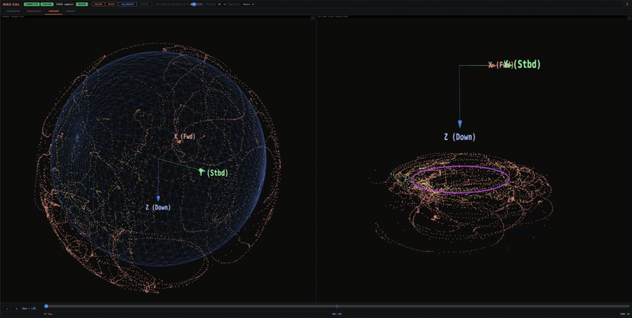
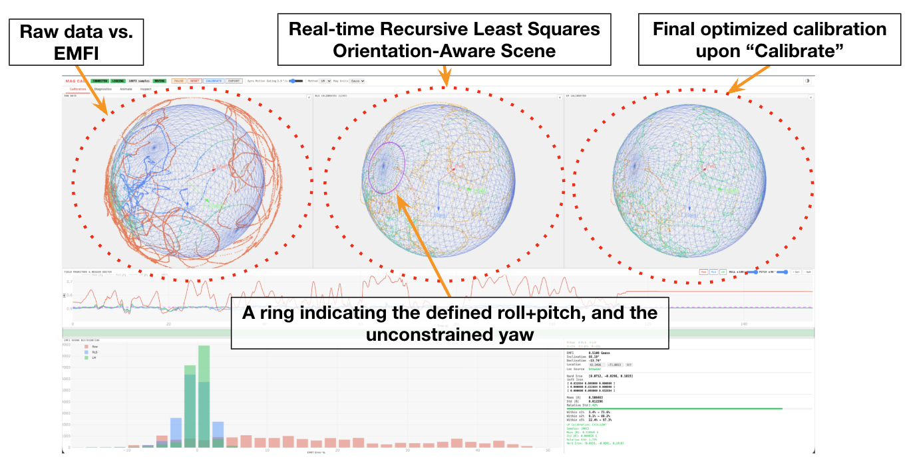
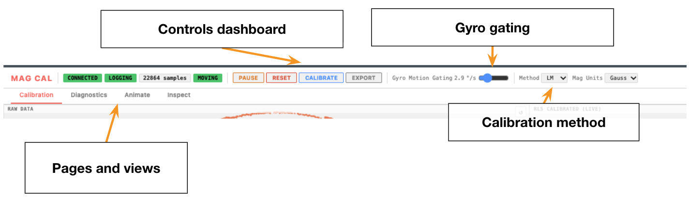
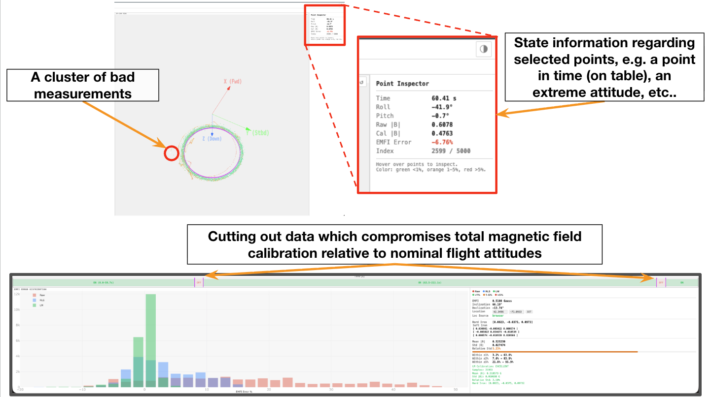
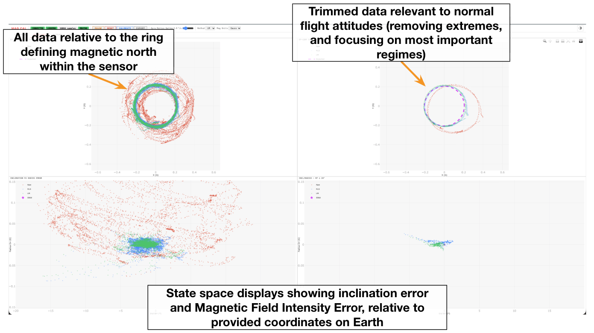
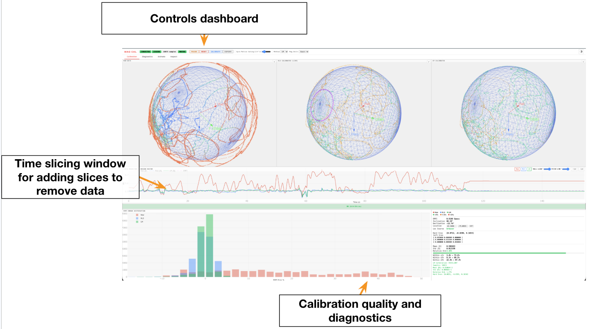

# magcc — Mag Cal Cockpit

Experimental and in active development. It works and is in use, but expect quirks and breaking changes between 0.x releases.



([full-resolution video](docs/media/magcc-animation_overview.mp4))

## Objective

Mag Cal Cockpit (magcc) aims to make magnetometer calibration easier in non-ideal conditions, with a real-time, intuitive display that guides the operator through the calibration and shows what data has been collected and what is still missing. It includes:

1. **Real-time adaptive calibration.** A recursive least-squares sphere fit updates as data arrives. For the current roll and pitch, with yaw undefined, the expected magnetic field intensity (EMFI) must lie on a ring on the sphere; one rotation at constant roll and pitch should fall on that ring. The ring is drawn live, so the operator can "paint the sphere" more intentionally.

   

2. **Gyro gating.** Samples are logged only while the sensor is rotating, to avoid redundant samples while it is stationary.

   

3. **Data inspection, trimming and pruning.** Slice the timeline, disable segments, limit roll and pitch, and inspect individual points (time, attitude, EMFI error), with displays that make each decision explainable.

   

4. **Saving and revisiting.** Each export stores the raw data, the calibration and the full session, so a calibration can be reopened with `--inspect` and time spent calibrating is not wasted.

5. **LSE-seeded Levenberg–Marquardt calibration.** From my own experimentation, this is what has worked best, and more methods may be added in the future.

6. **Local field reference.** EMFI, inclination and declination come from NOAA's WMMHR at the operator's location.

7. **Level-frame diagnostics.** Inclination error and field-intensity error per sample, relative to the local reference, to judge the calibration in the attitudes that matter.

   

8. **Sensor-agnostic input.** Any AHRS that sends a 13-field UDP packet works; `magcc-replay` replays logged CSVs.

## Install

```
pip install magcc          # or: pipx install magcc
```

Requires Python ≥ 3.11. This installs two commands, `magcc` and `magcc-replay`. If they aren't found on your `PATH`, use `python3 -m magcc` instead.

## Run

```
magcc                                  # listen on UDP 0.0.0.0:50100, UI on http://localhost:8080
magcc --lat 42.357 --lon -71.087       # fix the WMMHR location instead of using the browser's
magcc --out-dir ~/cal_runs             # where magcc_<timestamp>/ exports go (default: cwd)
magcc --inspect magcc_20260924_204908/magcc_session.json   # reload an exported session offline
magcc-replay magcc_20260924_204908/magcc_raw.csv --speed 3 # replay a CSV as magcc packets
```

| Option | Default | |
|---|---|---|
| `--udp-addr`, `--udp-port` | `0.0.0.0`, `50100` | UDP listen address |
| `--web-port` | `8080` | UI port |
| `--magcc` | `auto` | Packet schema: `auto` or `v0` |
| `--lat`, `--lon` | — | WMMHR location; overrides the browser |
| `--mount-roll/-pitch/-yaw` | `0` | Sensor mount angles (deg), display only |
| `--out-dir` | `.` | Export root |
| `--inspect` | — | Load a session JSON, no UDP |
| `--no-browser` | off | Don't open a browser |

### Field reference

The expected field strength, inclination and declination come from NOAA's WMMHR (`wmmhr` package) evaluated at today's date. Location is taken from, in order of precedence: `--lat/--lon` or the lat/lon typed into the UI, then the values saved in a session loaded with `--inspect`, then the browser's geolocation, then a Boston default. The UI shows which source is in use. Browsers only allow geolocation on `localhost` or HTTPS, so opening the UI from another machine by IP falls back to the default unless you set the location.

## Protocol (magcc v0)

One ASCII sentence per UDP datagram:

```
|ts,ax,ay,az,gx,gy,gz,mx,my,mz,roll,pitch,yaw*
```

| Field | Units |
|---|---|
| `ts` | seconds (epoch or monotonic) |
| `ax..az` | any (not used by the fit) |
| `gx..gz` | rad/s (motion gating threshold) |
| `mx..mz` | Gauss, µT or nT (select the matching unit in the UI) |
| `roll, pitch, yaw` | rad (roll/pitch used for level-frame diagnostics) |

Exactly 13 fields; anything else is ignored. `hbk_cv7_cli --mcc` sends this format. All vectors are in the sensor frame. With `--magcc auto` (default) magcc locks onto the first schema that parses. Later schemas will start with a tag field (e.g. `|MAGCC1,...*`) so they remain distinguishable from v0.

## Sensor requirements

The AHRS/IMU application feeding magcc must:

- send magcc v0 packets (above) over UDP to the magcc host and port;
- send **raw, uncalibrated** magnetometer data. Disable or clear any onboard hard/soft-iron calibration first, otherwise magcc fits on top of it;
- send roll/pitch from its own filter (used only for the level-frame diagnostics, not the fit).

## Workflow



1. Start the sensor stream and run `magcc`. In the dashboard, check the location source and set **Mag Units** to match the sensor.
2. **START**, then rotate the sensor slowly through every orientation until the point cloud covers the whole sphere. Only samples with gyro rate above the **Gyro Motion Gating** threshold are logged. **PAUSE** when done.
3. **CALIBRATE** fits hard and soft iron (LM or LSE, set by **Method**) to the local field strength. The RLS view updates live while logging; the LM/LSE result is the final one.
4. Optional cleanup, then **CALIBRATE** again:
   - The **Field Magnitude & Region Editor** plot shows field magnitude over time. Right-click the bar under it to split the timeline at that point; drag a split marker to adjust it, or double-click it to remove it; **+ Split / − Split** add or remove splits.
   - Left-click a block to toggle it **ON/OFF**. Only ON blocks are used in the fit.
   - **Roll ≤ / Pitch ≤** sliders exclude samples beyond those angles.
   - The **Inspect** tab shows per-point time, attitude and error to find the samples worth cutting.
5. **EXPORT** writes `magcc_<timestamp>/` with `mag_cal.dat`, `magcc_raw.csv` (with a `used` column for the fit mask) and `magcc_session.json` (reload with `--inspect`).

## Output: `mag_cal.dat`

```
b = bx,by,bz            # hard iron, in the selected unit
A = a11,a12,...,a33     # soft iron, 3x3 symmetric, row-major
```

Apply as `m_cal = A @ (m_raw - b)`. The `#` header records the method, unit, sample count, fit residuals and expected field strength.

## Illustrative comparison (no pruning)

The following table was generated by Claude (Anthropic's AI model), without thorough human review, applied to three random datasets I had on hand. It is not authoritative and is not an academic analysis; it is a one-time comparison made for this presentation only.

It was run **without any pruning**. Every sample in each session was used, which is the opposite of how magcc is meant to be used. Pruning (cutting disturbed segments, excluding attitudes outside the operating regime, inspecting outliers) is the practical part of magcc and the reason it exists: it lets the operator qualify the heading solution for the regime the vehicle actually operates in. None of that is reflected here.

Setup: three recorded sessions (S1 = 2026-05-27 19:43, S2 = 2026-08-13 16:36, S3 = 2026-05-27 18:10), decimated to 25 Hz. Each method is fit and scored on all of a session's data. Baselines come from the `magyc` package and MATLAB's `magcal`. Every calibrated output is rescaled so its mean |B| equals the EMFI, since several methods recover shape but not scale. Samples with non-increasing timestamps were dropped, and ellipsoid fits returned with a negative determinant were sign-corrected.

- **EMFI error:** mean of |‖B_cal‖ − EMFI| / EMFI, in %.
- **Inclination error:** mean |inclination − WMMHR inclination|, in degrees.
- **Scores:** rank of the mean, 1 = lowest error, out of 15. Methods with equal means (to two decimals) share a rank. Rows are in random order.

| Method | DOF | EMFI error % S1 | S2 | S3 | mean | Inclination error ° S1 | S2 | S3 | mean | EMFI Score | Inclination Score |
|---|---|---|---|---|---|---|---|---|---|---|---|
| hard iron only (`fit_eye` / sphere / MATLAB 'eye') | 3 | 1.37 | 1.86 | 1.43 | 1.56 | 1.27 | 1.81 | 1.19 | 1.42 | 10 | 1 |
| `twostep_hsi` | 9 | 0.98 | 1.58 | 0.93 | 1.16 | 1.40 | 1.86 | 1.20 | 1.49 | 1 | 4 |
| MAGYC LS | 9 | 1.11 | 2.06 | 1.43 | 1.53 | 1.47 | 2.04 | 1.24 | 1.58 | 8 | 10 |
| raw | 0 | 3.09 | 10.04 | 9.00 | 7.38 | 2.28 | 6.92 | 6.26 | 5.16 | 15 | 15 |
| `ellipsoid_fit` | 9 | 2.49 | 2.62 | 2.42 | 2.51 | 1.55 | 1.92 | 1.47 | 1.65 | 12 | 12 |
| MAGYC IFG | 9 | 2.51 | 5.28 | 5.54 | 4.44 | 1.79 | 4.76 | 4.96 | 3.84 | 14 | 14 |
| MATLAB `magcal` 'diag' | 6 | 1.01 | 1.62 | 0.95 | 1.19 | 1.41 | 1.86 | 1.20 | 1.49 | 5 | 4 |
| MAGYC NLS | 9 | 1.12 | 2.07 | 1.45 | 1.55 | 1.48 | 2.05 | 1.24 | 1.59 | 9 | 11 |
| magcc RLS (live) | 3 | 1.48 | 2.17 | 1.46 | 1.70 | 1.46 | 1.91 | 1.18 | 1.52 | 11 | 9 |
| MATLAB `magcal` 'auto' | 9 | 0.99 | 1.56 | 0.93 | 1.16 | 1.42 | 1.89 | 1.20 | 1.50 | 1 | 7 |
| magcc LSE only | 9 | 0.99 | 1.59 | 0.98 | 1.19 | 1.36 | 1.89 | 1.17 | 1.48 | 5 | 2 |
| magcc LSE+LM | 9 | 0.98 | 1.58 | 0.93 | 1.16 | 1.40 | 1.87 | 1.20 | 1.49 | 1 | 4 |
| `fit_diag` | 6 | 1.00 | 1.65 | 0.95 | 1.20 | 1.40 | 1.84 | 1.20 | 1.48 | 7 | 2 |
| MAGYC BFG | 9 | 1.69 | 5.28 | 6.19 | 4.39 | 1.33 | 4.73 | 5.21 | 3.75 | 13 | 13 |
| `ellipsoid_fit_fang` | 9 | 0.99 | 1.57 | 0.93 | 1.16 | 1.42 | 1.89 | 1.19 | 1.50 | 1 | 7 |

The sessions were collected by hand-tumbling the sensor, which is well outside the slow-rotation regime the MAGYC methods were designed for.

## Known quirks

- Reloading the page re-runs calibration on all samples and drops block/roll/pitch filters. Re-apply them before exporting.
- Calibrating with too little orientation coverage fails with a numpy complex-cast error instead of a clear message.
- The UI loads plotly and three.js from CDNs, so it needs internet access.
- The UI and its controls are open to anyone on the network, with no authentication.
- Without a location (no `--lat/--lon`, browser location denied), the field reference defaults to Boston.
- Only tested on macOS.

## License

Copyright (C) 2026 Raymond Turrisi, Massachusetts Institute of Technology

Licensed under GPL-3.0-only. See the LICENSE file.

If you have been granted a license under the source-available "MIT Spurdog AUV" license, that license supersedes the GPL-3.0 license for your use of this software.
